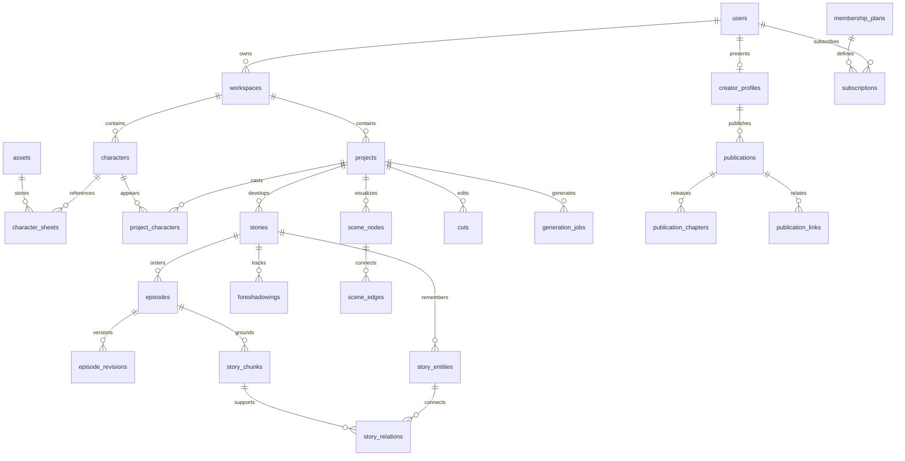

# Snowlink Studio 데이터베이스 설계

PostgreSQL 16 이상을 기준으로 한 실행 가능한 초기 설계입니다. `001_schema.sql`과 `002_demo_seed.sql`은 **새 개발 DB**에 적용하는 파일이며, 현재 운영 중인 JSON 저장소를 변경하거나 이전한 상태가 아닙니다. 탐색 화면은 `apps/studio/app/_lib/showcase-data.json`을 사용합니다. 운영 DB 연결·실사용자 게시 API는 후속 구현 대상입니다.

## 핵심 관계



| 영역 | 테이블 | 저장 원칙 |
|---|---|---|
| 계정·프로필 | users, credentials, auth_sessions, creator_profiles | 로그인 정보와 공개 프로필을 분리. 기존 scrypt 버전·salt·비용 인자를 password_record로 보존. 목업 계정에는 credentials가 없음 |
| 작업실 | workspaces, projects, assets, prompt_templates | 소유자가 인증된 작업실에 속함. 미디어는 파일/오브젝트 저장소에, DB는 키·크기·출처만 저장 |
| 캐릭터 | characters, character_sheets, project_characters | 캐릭터와 시트 버전, 작품에 등장하는 관계 분리 |
| 소설·시나리오 | stories, episodes, episode_revisions | 전체 플롯→회차 플롯→원고. 화수 중복 방지, 원고 수정 이력과 글자 수 조건 보존 |
| GraphRAG | story_entities, story_relations, story_chunks, foreshadowings | 관계에 근거 원고·리비전·문자 위치를 연결. 복선의 배치/회수 회차와 상태 추적 |
| 이미지·영상·컷 | scene_nodes, scene_edges, cuts, generation_jobs | 노드/간선, 컷 순서/시간, 생성 작업 상태·멱등키·결과물 관리 |
| 공개 탐색 | publications, publication_chapters, publication_links | 작업 원본과 **명시적으로 공개한 스냅샷** 분리. 기본값 private/draft |
| 멤버십 | membership_plans, subscriptions, billing_events | 유료 가격 미정은 NULL. 현재 결제 UI는 DB·PG 호출을 하지 않음 |
| 연동 | oauth_connections, mcp_grants, mcp_tokens | 외부 자격증명 암호화, 내부 액세스/갱신 토큰은 해시만 저장. 연결 철회 기록 |

## 공개와 소유권

1. 창작자가 공개를 선택한 항목만 `publications`로 복사합니다. 서버가 제목·소개·태그·공개 본문·선택 이미지·선택 회차를 허용 목록으로 추출합니다. 내부 프롬프트, 미완성 플롯, GraphRAG 근거, 개인 OAuth 정보는 복사하지 않습니다.
2. 이미지 공개본은 `/published/` 저장 경로로 복사합니다. 기존 `/media/`나 비공개 저장 키를 외부에 노출하지 않습니다. 목업 이미지에만 `/showcase/`를 사용합니다.
3. `public_showcase`는 `public + published + 공개 프로필 + 탈퇴하지 않은 계정`만 반환합니다. `unlisted`와 `private`는 피드에 포함하지 않습니다. 공개 링크 뷰는 연결된 양쪽 작품 모두 공개인 경우만 반환합니다.
4. 사용자용 SQL 역할은 테이블 소유자·superuser·BYPASSRLS 권한을 갖지 않습니다. 인증된 세션의 작업실을 확인한 서버가 **트랜잭션 안에서** `SET LOCAL snowlink.workspace_id = '<verified workspace UUID>'`를 설정합니다. 요청 본문의 workspace_id를 그대로 신뢰하거나 커넥션에 영구 SET하지 않습니다.
5. 작업실 테이블에는 RLS를 적용했습니다. 복합 외래키로 다른 사용자의 캐릭터·에셋·회차를 연결하는 것도 차단합니다. 계정·자격증명·구독 등 사용자 단위 테이블은 브라우저/공개 reader 권한을 주지 않고 전용 백엔드 경로로만 접근합니다.
6. 공개 reader 역할에는 스키마 USAGE와 `public_showcase`, `public_chapters`, `public_related_works` SELECT만 부여합니다. 이 뷰는 소유자 권한으로 명시된 공개 필드만 읽습니다. 원본 테이블을 직접 SELECT하는 권한은 주지 않습니다.
7. 비공개 전환/삭제 시 공개 스냅샷, 검색 캐시·CDN 및 공개 파일을 함께 무효화해야 합니다. 공개했다가 이미 외부에 복사된 파일까지 회수할 수 있다고 보장하지 않습니다.

## 연속 이야기와 GraphRAG

- 회차 생성은 story 단위 잠금으로 순서를 보장하고, 현재 회차보다 앞선 확정 원고만 참조합니다. `introduced_in`, `valid_from_episode`를 조회 상한으로 사용해 미래 사건을 미리 가져오지 않습니다.
- 수정 전 원고는 `episode_revisions`에 보존합니다. 변경된 회차 이후 원고는 `needs_review`로 표시하고 해당 근거의 청크·관계·요약을 다시 계산합니다. 문자열 길이는 공백 포함 여부와 Unicode 기준을 애플리케이션에서 일관되게 계산합니다.
- 청크 임베딩은 모델명·차원과 함께 저장합니다. 현재 SQL의 `real[]`는 모델을 결정하기 전 저장 구조이며 ANN 인덱스는 없습니다. 실제 검색 모델을 확정하면 별도 마이그레이션으로 pgvector의 고정 차원 컬럼과 HNSW 인덱스를 추가합니다. 한국어 키워드 검색은 `simple` 토큰화만으로 충분하지 않으므로 임베딩 검색·관계 탐색과 함께 평가해야 합니다.
- 복선 회수 순서, 필수 근거의 현재 리비전 일치, 장면 그래프의 순환 여부는 서비스 트랜잭션 검증이 추가로 필요합니다. DDL만으로 생성 순서나 이야기 품질을 보장하지 않습니다.

## 초기 실행 및 목업

```sh
node database/create-demo-seed.mjs
# DATABASE_URL은 새 개발 DB만 지정하세요. 기존 운영 DB에는 실행하지 않습니다.
psql "$DATABASE_URL" -v ON_ERROR_STOP=1 -f database/001_schema.sql
psql "$DATABASE_URL" -v ON_ERROR_STOP=1 -f database/002_demo_seed.sql
# 폐기 가능한 개발 DB에서만 공개 범위·소유권 검증 (검증 변경은 rollback)
psql "$DATABASE_URL" -v ON_ERROR_STOP=1 -f database/verify.sql
```

시드는 화면의 동일한 데이터로 가상 창작자 3명, 캐릭터 3개, 소설 3개/6개 회차, 이미지 콘텐츠 3개, 연결 관계와 멤버십 구성안 3개를 생성합니다. 모든 공개 목업은 `is_demo=true`이며 로그인 가능한 비밀번호와 유료 구독은 생성하지 않습니다. `ON CONFLICT DO NOTHING`으로 동일 시드 재실행을 허용합니다. 내용 변경을 기존 시드 행에 자동 덮어쓰지는 않습니다.

## 운영 이전 순서

1. `.data` 원본과 업로드 파일을 백업하고 신규 DB를 준비합니다. UUID를 유지한 채 accounts/users별 studio·scenario·graph·job 데이터를 검증하며 가져옵니다.
2. FastAPI repository 계층을 DB로 연결하고 세션/소유권 검사·공개 스냅샷 생성 API를 구현합니다. 기존 Node 운영 서버와 진행 중인 Python 전환은 이번 설계로 변경하지 않습니다.
3. `/api/public/works`에 kind·검색·creator·cursor를 지원하고, `(published_at, id)` 커서로 안정적으로 페이지를 나눕니다. 단일 작품/창작자/공개 회차 조회도 공개 뷰만 사용합니다.
4. 공개·비공개 전환, 타 사용자 조회/수정 차단, 업로드 검증, GraphRAG 시점/리비전, 생성 중복 요청을 검증합니다. 프론트의 목업 adapter를 API adapter로 교체합니다.
5. 멤버십 결제가 필요해지는 시점에 PG 웹훅 서명 검증, billing_events 멱등 처리, 구독 권한 계산을 구현합니다. 현재 미리보기 버튼으로 활성 구독을 만들면 안 됩니다.

참고: [PostgreSQL RLS](https://www.postgresql.org/docs/current/ddl-rowsecurity.html), [복합 키와 제약](https://www.postgresql.org/docs/current/ddl-constraints.html).
