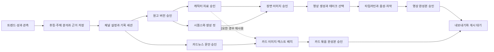

# snowlink-studio PRD

버전 1.1 · 요구사항 갱신일 2026-10-04 · 코드 조사 기준일 2026-10-03 · 상태: 서비스 개선 설계

이 문서는 이미 구현된 기능과 앞으로 구현할 요구사항을 구분한다. 사용자와 합의한 채널별 운영, 영상·카드뉴스 동시 개발, GPT/Grok OAuth, 단계별 승인을 유지하면서 노드 기반 제작 구조를 추가한다. 기능 구현 완료를 뜻하지 않는다.

관련 문서: [트렌드 분석과 제작 근거 축적](trend-intelligence-plan.md), [시장 조사](market-research-2026-10.md), [노드 워크플로 설계](node-workflow-design.md), [사용자 요구와 제작 기획](production-plan.md), [애니메이션 세부 계획](animation-workflow-plan.md), [영상 레퍼런스 분석](reference-analysis.md).

10월 4일 확정: AI 대화로 노드 초안을 구성하는 제작 방식, 성과가 좋은 콘텐츠의 주제·후킹 분석과 지속 축적, 축적 자료를 사용하는 생성, 주제별 가변 카드뉴스 분량, 본인만 쓰는 개인 도구. 팀·외부 고객용 기능은 현재 로드맵에서 제외한다.

## 1. 제품 정의와 핵심 판단

**snowlink-studio는 트렌드와 성과가 좋은 콘텐츠의 주제·후킹·전개를 축적하고, 이를 채널별 AI 기획과 노드 제작에 활용해 썰 영상과 카드뉴스를 완성하는 개인 작업실이다.**

현재는 트렌드, 생성 도구, 캐릭터, 기획 보드, 대화 컷 편집을 한곳에 모은 단계다. 다음 개선의 중심은 도구를 더 붙이는 것이 아니라, 각 도구가 같은 작품·장면·자산 버전·승인 상태를 사용하도록 연결하는 것이다.

React Flow 노드 화면과 연결 검사는 이미 내재화되어 있다. 이를 확장해 `원고 → 캐릭터 → 장면 이미지 → 실제 영상 → 편집 → 승인`을 실행한다. 초기에는 ComfyUI 서버를 필수 설치하지 않는다. ComfyUI와 유사한 조작 방식과 제작 단위의 노드를 채택하며, 실제 ComfyUI 연결은 별도 어댑터 후보로 남긴다.

시장에서도 노드, 재사용 템플릿, 타임라인이 제공되고 있다. 제품의 차별화 가설은 **다중 채널의 기억·캐릭터·승인·운영을 영상과 카드뉴스 양쪽에 연결하는 것**이다. 경쟁사가 이 전체 범위를 제공하지 않는다는 사실까지 확인한 것은 아니다. 근거와 한계는 [시장 조사](market-research-2026-10.md)에 정리했다.

## 2. 대상 사용자와 해결할 문제

| 대상 | 해야 하는 일 | 현재 불편 | 기대 결과 |
| --- | --- | --- | --- |
| 1차: 여러 채널을 운영하는 개인 제작자 | 채널별 소재를 고르고 매일 콘텐츠 제작 | 설정·캐릭터·대본을 도구마다 옮김 | 채널을 선택하면 해당 규칙과 자료로 제작 시작 |
| 1차: 썰·애니메이션 제작자 | 인물과 연기가 이어지는 영상을 완성 | 잘못된 한 컷 때문에 전체를 다시 만듦 | 해당 컷만 재생성하고 채택 구간을 교체 |
| 1차: Instagram 카드뉴스 운영자 | 계정별 문안·배치·출처를 관리 | 문구 수정과 이미지 재생성이 얽힘 | 텍스트와 시각 자료를 분리하고 게시물 묶음으로 승인 |

위 세 역할은 한 명의 사용자가 수행한다. 본인만 쓰는 개인 도구로 확정했으며 기존 Mac + Tailscale 환경을 유지한다. 채널별 자료 구분과 여러 플랫폼 계정 연결은 필요하지만 회원가입·팀 권한·결제·외부 고객 모집은 현재 범위가 아니다.

## 3. 사용자와 합의한 제품 조건

- 썰 영상과 카드뉴스를 함께 개발한다. 채널별 주제·시청자·언어·스타일·음성·캐릭터 정책을 설정한다.
- 트렌드 또는 자유 대화에서 세션을 시작하고, 채널 규칙과 세션의 확정 결정을 기억한다.
- AI 대화가 기본 제작 시작점이다. 축적한 자료를 검색해 기획 후보와 노드 초안을 제안하고 사용자가 수정한다.
- 조회수가 높은 영상 등의 주제·후킹·전개를 출처와 확인 범위에 연결해 지속 축적하고 실제 원고 생성에 사용한다. 관측 성과와 성공 원인에 대한 추정을 구별한다.
- 카드뉴스 장수는 주제·정보량·가독성에 맞춰 콘텐츠마다 제안하고 사용자가 조정한다.
- 캐릭터는 고정 출연진, 작품별 캐스팅, 신규 캐릭터를 모두 허용한다.
- 썰 영상은 시퀀스와 생성 컷으로 분리하고 시트·베이스 이미지에서 실제 움직이는 영상으로 만든다.
- Shorts의 기본 완성 길이는 30~60초다. 긴 영상은 30~60초 구간들을 연속 재생하고 이전 구간의 채택된 마무리를 다음 구간에 전달한다.
- 원고·캐릭터·장면 이미지·완성본을 각각 승인한다. 영상과 카드뉴스의 원고·최종 승인은 독립적이다.
- 하루 목표는 썰 영상 1개와 카드뉴스 3개다. 제작 목표와 게시물별 장수를 분리하고 전체/채널별 목표 범위는 미정으로 유지한다.
- 장면당 최초 생성 1회 + 자동 재생성 최대 3회를 기본으로 한다. 초안·고화질 재생성도 이 횟수에 포함한다.
- 생성은 기존 GPT OAuth·Grok OAuth 연결을 우선 사용한다. OAuth 인증 성공과 특정 모델·해상도·음성 지원은 별도로 검사한다.
- 기존 왼쪽 메뉴와 내재화 UI의 사용 흐름을 보존하고, Snow & Autumn 공용 디자인 토큰을 적용한다.

## 4. 현재 구현 수준

아래는 2026-10-03 소스 조사 결과다. `있음`은 관련 코드가 존재함을 의미하며 모든 외부 모델의 실사용 성공을 보증하지 않는다.

| 영역 | 현재 상태 | 근거 |
| --- | --- | --- |
| 통합 작업실 | 사이드바, 로컬 실행, Tailscale 경로, 공용 테마 있음 | [README](../README.md), [디자인 시스템](../design/README.md) |
| 트렌드 탐색 | 원래 UI 소스 내재화, 키워드별 YouTube·Shorts 검색과 수집된 TikTok 조회 | [discovery.mjs](../server/discovery.mjs); Instagram·X는 제한 안내 상태 |
| 생성 UI | React UI를 작업실 DOM에 마운트, 기획·캐릭터 참조 전달, 생성 이미지를 캐릭터로 등록 | [StudioBridge.tsx](../vendor/ima2-ui/src/StudioBridge.tsx) |
| 노드 제작 | React Flow, 이미지·참조 노드, 포트 검사, 순환 방지, 의존 순서 배치 실행 | [NodeCanvas.tsx](../vendor/ima2-ui/src/components/NodeCanvas.tsx), [storeNodeGenImpl.ts](../vendor/ima2-ui/src/store/storeNodeGenImpl.ts) |
| 카드뉴스 도구 | 초안·템플릿·문구 필드·카드별 재생성 코드 있음. 기본 제품 빌드에서는 개발 모드 게이트로 숨김 | [cardNewsStore.ts](../vendor/ima2-ui/src/store/cardNewsStore.ts), [devMode.ts](../vendor/ima2-ui/src/lib/devMode.ts) |
| 캐릭터·제작 보드 | 단일 시트 이미지와 기획 저장, 단계 변경, 보관·복원, 수정 충돌 검사 | [store.mjs](../server/store.mjs) |
| AI 설정 | 기획/대화/이미지/영상 역할별 제공자·모델 저장, OAuth 연결 | [modelSettings.mjs](../server/modelSettings.mjs) |
| 컷 대화 | 컷 편집, 순서·길이·원고 변경, revision과 20회 되돌리기 | [cuts.mjs](../server/cuts.mjs); 한 컷당 한 characterId |
| 콘티 출력 | ShortGPT로 캐릭터 이미지와 대사를 합성한 무음 MP4 | [render.mjs](../server/render.mjs), [render_shortgpt.py](../scripts/render_shortgpt.py) |
| 자동 제작·게시 | 채널/세션 기억, 작품 단위 실행기, 버전별 승인, 실제 영상 최종 편집, 게시 계정 연결은 미구현 | [app.mjs](../server/app.mjs), [aiRoutes.mjs](../server/aiRoutes.mjs) 및 위 저장 구조 |

독립 생성 도구의 영상 기능과 작품 전체의 영상 제작 파이프라인을 구별한다. 현재 콘티 MP4는 완성 썰 영상이 아니다. 카드뉴스도 개발용 도구를 제품 흐름에 연결하고 품질을 검증하는 작업이 필요하다.

## 5. 부족한 부분과 우선순위

P0는 첫 실제 작품을 안정적으로 완성하는 데 필요한 기반, P1은 반복 제작의 효율·품질, P2는 외부 발행·확장 기능이다. 순서는 기술 의존성과 사용자 목표를 기준으로 정했으며 시장 수요 점수로 포장하지 않는다.

| ID | 부족한 부분과 사용자 영향 | 코드에서 확인한 원인 | 개선 / 우선순위 |
| --- | --- | --- | --- |
| G01 | 생성물이 어느 작품·컷의 결과인지 추적하기 어려움 | bridge는 참조 전달·캐릭터 등록 중심; 기획 모델에 shot/take 참조 없음 | 공용 자산 ID·버전과 작품/컷 연결 / P0 |
| G02 | 채널별 언어·캐릭터·기억이 분리되지 않음 | store에 채널·세션 모델 없음; 컷 대화는 제한된 최근 메시지 사용 | 채널 프로필, 세션, 편집 가능한 확정 메모리 / P0 |
| G03 | 원고·캐릭터·영상·승인이 섞인 그래프를 실행할 수 없음 | 현재 노드 종류가 이미지·참조 중심, 배치의 영상/이미지 실행 선택은 전역 상태에 의존 | 노드 종류별 실행 계약과 서버 제작 그래프 / P0 |
| G04 | 허브 작업이 중단되면 상태를 믿고 재개하기 어려움 | 콘티 렌더 작업은 메모리 Map; 제작 전체의 영속 실행 이력 없음 | 영속 큐·업스트림 작업 매핑·복구 / P0 |
| G05 | 승인한 버전과 수정 후 버전을 구분하지 못함 | 보드 stage는 일반 필드; 승인 기록·산출물 계보 없음 | 버전 승인, 영향 계산, 서버 실행 게이트 / P0 |
| G06 | 움직이는 영상·대사를 하나의 결과물로 조립하지 못함 | 허브 렌더는 이미지 중심, audio_assets 비어 있음 | 테이크 선택·실제 클립 합성·음성/자막 트랙 / P0 최소형, P1 확장 |
| G07 | 캐릭터 정체성·목소리·장면 연결 관리가 약함 | 캐릭터는 단일 이미지, 컷은 단일 인물; 기존 연장은 원본 영상 기준 | 역할별 시트, 복수 배역, 실제 편집 끝 프레임과 연결 상태 / P0 자료, P1 연속성 |
| G08 | 카드뉴스 코드가 일반 제품 흐름에 노출·연결되지 않음 | 개발 모드 게이트; 작품·채널·승인과 별개 상태 | 기존 도구를 채널 템플릿·승인·내보내기에 연결 / P0 |
| G09 | 로그인됐어도 원하는 생성 조합이 가능한지 불명확 | 전역 역할 설정, 모드별 조건이 여러 어댑터에 분산 | capability 응답, 실행 설정 스냅샷, 사용량·한도 표시 / P0 |
| G10 | SNS 수집 실패의 현재 상태를 판단하기 어려움 | 일부 제공자 안내가 이전 실패에 근거한 고정 메시지 | 마지막 성공/시도 시각, 수집 방식, 오류와 대체 경로 표시 / P1 |
| G11 | 긴 영상 재생과 완전한 백업이 불충분 | 허브 정적 파일은 전체 읽기; 메타데이터 export에 이미지·컷·렌더 제외 | 자체 영상 Range 지원, 지연 로딩, 자산 포함 백업/복원 / P1 |
| G12 | 매일 목표량을 발행하는 운영 자동화 없음 | 플랫폼 계정·발행 작업·예약 큐 모델 없음 | 승인 대기와 제작 목표를 분리한 운영 큐 / P2 |
| G14 | 트렌드 분석이 누적된 제작 근거로 이어지지 않음 | 허브 discovery는 목록 정규화와 단기 캐시; 장기 후킹 분석·원고 근거·작품 성과 모델 없음 | 분석 버전·출처·검색과 생성 입력 연결 / P0, 반복 관측·성과 피드백 / P1 |

G04는 기존 ima2 생성 작업의 개별 복구 기능까지 없다는 뜻이 아니다. 이를 작품 단위 실행 이력에 연결해야 한다. G11도 기존 업스트림 프록시의 Range 지원과 구분한다. G10의 과거 401/429를 이번 조사일에 재현한 것으로 기록하지 않는다.

기존 G13의 다중 사용자 공개 서비스 준비는 개인용 범위 확정으로 현재 개선 목록에서 제외했다.

## 6. 목표 사용자 경험

왼쪽 메뉴에서 채널을 선택하고 **AI 기획 대화**를 시작한다. AI는 누적된 관련 사례와 후킹 분석을 보여주고 검증된 템플릿으로 노드 초안을 제안한다. 작품 내부는 **대화 / 단계 보기 / 노드 보기 / 타임라인**으로 접근하며 동일한 데이터와 버전을 편집한다. 사용자는 대화에서 방향을 정하고 필요한 노드·참조·모델을 직접 수정한다.

게시 후 내 작품의 성과를 같은 작품·원고·후킹 버전에 연결해 다음 세션의 자료로 사용한다. 이 피드백은 작품 간 데이터 흐름이며 한 실행 그래프의 순환 연결이 아니다. 외부 원본 지표의 보관·갱신과 분석 가능 범위는 [상세 설계](trend-intelligence-plan.md)를 따른다.

노드 연결은 생성의 의존 관계이고, 타임라인은 재생 순서다. 화면에서 노드를 옮겼다는 이유로 컷 순서를 바꾸거나 생성 요청을 보내지 않는다. 긴 영상의 다음 구간은 이전 구간에서 실제 채택한 종료 시점의 프레임·인물·소품·사건 상태를 입력받는다.

대화로 “3번 컷의 끝을 2초 줄이고 다음 컷을 이어줘”라고 하면 변경 전후와 영향 범위를 제안한다. 사용자가 적용한 뒤 필요한 후속 컷만 실행한다. 이미 승인한 관련 없는 컷은 유지한다.

## 7. 기능 요구사항과 수용 기준

모든 항목은 추가 개발 또는 기존 코드 확장 요구사항이다. 릴리스 R1~R4의 정의는 10절에 있다.

| ID / 단계 | 요구사항 | 완료를 판단할 수용 기준 |
| --- | --- | --- |
| FR01 / R1 | 채널 프로필과 설정 상속 | 서로 다른 두 채널의 언어·시청자·스타일·캐릭터 정책을 저장한다. 채널→세션→컷 예외와 적용 출처가 보인다. 채널 기본값 변경이 진행 중 작품의 설정을 바꾸지 않는다. |
| FR02 / R1 | 기획 세션과 메모리 | 트렌드 출처 URL·수집 시각과 대화 원문을 저장한다. 사실/사용자 결정/AI 제안을 구분해 편집·삭제한다. 재접속과 모델 교체 후 복원되며 다른 채널의 비공유 기억이 섞이지 않는다. |
| FR03 / R1 | 캐릭터와 자산 버전 | 정체성 ID 아래 얼굴·전신·의상·표정 자료를 여러 버전으로 저장한다. 복수 배역과 배경·소품을 역할로 연결한다. 생성 이미지·영상에 작품/컷/테이크 ID와 실제 파일 정보를 남긴다. |
| FR04 / R1 | 이야기 분해 | 작품→구간→시퀀스→생성 컷→테이크를 저장한다. 컷마다 배역·대사·행동·시작/종료 상태를 편집하고 원고 버전까지 추적한다. 완성 30~60초와 단일 모델 호출 길이를 구별한다. |
| FR05 / R1 | 대화로 시작하는 제작 노드 | AI가 기획 대화와 근거 자료로 검증된 템플릿의 노드 초안을 제안한다. 원고·참조·이미지·영상·선택·승인·출력 노드의 자료형/입력/순환/모델 능력을 검사한다. 대화·단계·노드 보기에서 같은 작품 버전을 사용한다. |
| FR06 / R1 | 실행·재접속·재시도 | 브라우저를 닫아도 서버 실행이 유지된다. 서버 재시작 후 접수된 작업을 조회·복구한다. 접수 여부가 불명확한 요청은 자동 중복 전송하지 않는다. 최초 1회+자동 재생성 3회 이후 검토 대기한다. |
| FR07 / R1 | 네 단계 승인 | 원고/캐릭터/장면 이미지/완성본을 대상 버전에 묶는다. 상위 입력이 바뀌면 영향받은 승인만 재검토 상태로 전환한다. 노드를 우회 연결하거나 직접 API를 호출해도 필요한 승인을 건너뛰지 못한다. |
| FR08 / R1 | 모델·인증·모드별 지원 검사 | 기본 역할별 설정과 노드별 변경을 저장한다. 실제 제공자·모델·기획기/렌더러·인증 참조를 실행 시 고정한다. 지원하지 않는 참조/음성/해상도 조합은 이유를 표시하고 막는다. 유료 제공자로 임의 전환하지 않는다. |
| FR09 / R1→R2 | 영상 테이크와 타임라인 | R1: 선택 클립과 사용 구간으로 실제 유음 영상 파일을 조립한다. R2: 한 컷에서 A/B 테이크의 서로 다른 구간을 채택하고 자막·음량·전환을 조정한다. 원본을 보존하고 실제 측정 길이를 사용한다. |
| FR10 / R2 | 긴 영상과 연속성 | 30~60초 구간 두 개 이상을 웹에서 연속 재생한다. 앞 구간의 편집 종료점을 바꾸면 이를 참조하는 다음 구간만 재검토 표시한다. 프레임 추출 실패를 조용히 텍스트 생성으로 대체하지 않는다. |
| FR11 / R1→R2 | 주제별 분량의 카드뉴스 | R1: 정식 진입점·채널 연결, 주제별 카드 수와 각 카드의 필요 이유를 제안하고 합치기/나누기를 저장한다. 문안/시각자료/완성본 승인 후 묶음으로 내보낸다. R2: 별도 텍스트 레이어·브랜드 템플릿으로 문구 수정 시 그림 재생성을 피한다. |
| FR12 / R2 | 대화 기반 그래프 수정 | AI가 허용된 수정안만 반환한다. 대상 노드·변경 전후·승인 영향·재실행 대상을 보여주고 적용한다. 충돌 검사를 거치고 되돌리기로 이전 그래프와 선택 결과를 조회·복원한다. |
| FR13 / R2 | 재사용·부분 실행 | 채널별 영상/카드 템플릿과 버전 있는 하위 그래프를 저장한다. 선택 결과까지 실행하거나 변경된 분기만 실행한다. 기존 결과 고정과 새 후보 생성을 구분하며 변경 없는 컷의 생성 호출은 0회다. |
| FR14 / R2 | 트렌드 신뢰도와 운영 현황 | 키워드별 검색/기수집/미지원 상태와 시각·오류를 구분한다. 추정 원인과 실제 재확인 결과를 분리한다. 채널별 승인 대기·실패·완료·목표량을 보여준다. |
| FR15 / R3 | 계정 연결과 예약 게시 | AI OAuth와 플랫폼 OAuth를 별도로 관리한다. 승인된 출력 버전·대상 채널·게시 설정으로만 실행한다. 접수 불명확 시 원격 확인 후 처리하여 중복 발행을 방지한다. 예약 취소·재인증·실패 복구가 가능하다. |
| FR16 / R4 | 선택적 ComfyUI 연동 | 등록된 엔드포인트와 명시한 입출력의 워크플로만 어댑터로 연결한다. 연결이 없어도 기본 GPT/Grok 제작은 동작한다. ComfyUI JSON 전체 호환이나 사용자 코드 설치를 기본 기능으로 약속하지 않는다. |
| FR17 / R1→R2 | 트렌드·후킹 분석 축적 | 콘텐츠 ID·출처·관측 시각·자료 범위와 주제/후킹/전개 분석 버전을 저장한다. 제목만 본 경우 영상 분석 완료로 표시하지 않는다. R2에서 주기 관측과 수집 경로별 갱신·만료를 적용하며 미제공 지표는 0으로 채우지 않는다. |
| FR18 / R1 | 근거 기반 기획·생성 | 채널·주제·형식에 맞는 누적 자료를 검색해 후보와 선택 이유를 제시한다. 채택한 자료·분석 버전을 ResearchBundle로 고정하고 원고/노드와 연결한다. 근거가 없으면 부족 상태를 표시하고 성공 원인을 단정하지 않는다. |
| FR19 / R2→R3 | 내 작품 성과의 환류 | R2에서 수동 게시물 연결과 가능한 읽기 전용 플랫폼 연결을 제공한다. 실제 지표·사용자 평가를 작품/후킹 버전에 연결해 다음 기획에서 조회한다. R3에서는 게시 작업과 자동 연결하며 채널 규칙 변경은 사용자가 채택한다. |

캐릭터를 쓰지 않는 카드뉴스의 캐릭터 승인은 `적용 없음` 사유로 기록한다. 장면 이미지 승인은 카드의 시각 자료·배치 승인에 대응한다. 반복 제작에서도 원고/완성본 승인을 생략하지 않으며, 정확히 같은 승인된 캐릭터 버전은 범위가 맞을 때 재사용한다.

## 8. 비기능 요구사항과 운영 원칙

| ID | 요구사항 / 검증 방법 |
| --- | --- |
| NFR01 데이터 일관성 | 서버가 승인·실행 상태의 기준이다. 낡은 revision 수정은 충돌로 응답한다. 중복 이벤트·새로고침이 결과를 중복 등록하지 않는지 장애 주입으로 확인한다. |
| NFR02 복구·보존 | 실행/제출 의도는 영속 저장하고 파일은 별도 보관한다. 참조 중인 자산 삭제를 막는다. 기획·그래프·컷·승인·원본·출력물을 포함한 백업을 빈 저장소에 복원해 참조 누락 0건을 확인한다. OAuth 비밀은 일반 내보내기에서 제외한다. |
| NFR03 생성 한도 | 제공자별 동시 실행·사용량 제한을 적용한다. 401/429/미지원과 품질 재생성을 구별한다. 사용량·비용 미제공 시 `알 수 없음`으로 표시하고 무료로 계산하지 않는다. |
| NFR04 영상·캔버스 성능 | 대표 데스크톱 환경을 기록하고 100노드/150연결에서 조작 응답 p95 100ms 이내를 초기 목표로 측정한다. 썸네일 지연 로딩, 긴 영상 Range/탐색, 숨긴 영상 정지를 검증한다. 현재 측정 결과가 아닌 목표다. |
| NFR05 접근성과 디자인 | 기존 공용 토큰을 확장한다. 상태는 색+문구/아이콘으로 표시하고 키보드 선택·명령 실행·포커스를 지원한다. 좁은 화면에서는 단계 보기와 검토를 우선한다. |
| NFR06 자격증명·채널 경계 | 개인 Mac + Tailscale 환경에서 토큰을 브라우저·그래프·로그에 넣지 않는다. 채널별 데이터와 자격증명 참조를 구분하고 공용 자산만 명시적으로 재사용한다. 팀 사용자·테넌트 권한 모델은 구현하지 않는다. |
| NFR07 관측 가능성 | 실행 ID·컷 ID·업스트림 ID·시도·실패 단계·실제 모델을 연결한다. 작업 대기/승인 대기/모델 생성 시간을 나눠 측정한다. 작품의 실제 파일을 외부 분석 서비스로 자동 전송하지 않는다. |
| NFR08 분석 신뢰성과 수명 | 관측 지표·콘텐츠 분석·사용자 결정을 구분한다. 확인한 입력·구간·시각을 기록한다. 수집 경로별 보관/분석 허용 조건을 적용하고 만료·삭제된 근거 및 종속 분석을 검색에서 제외하거나 갱신한다. |

음성·표정·캐릭터 일관성·한국어 대사의 정확성은 사람의 재생 검토를 포함한다. 현재 모델의 동시 음성 생성만으로 원하는 대사와 목소리가 항상 나온다고 가정하지 않는다. 자동 검사 도구가 없는 검사는 완료 처리하지 않는다.

## 9. 데이터와 구현 경계

공용 식별자는 `channelId / sessionId / productionId / sequenceId / shotId / assetVersionId / workflowRevisionId / runId`다. 자산은 생성 파일을 복사해 중복 소유하기보다 기존 파일 참조와 출처를 등록하고, 승인 대상 버전을 불변으로 보관한다.

| 데이터 | 책임 |
| --- | --- |
| ChannelProfile / PlatformConnection | 채널 운영 규칙과 외부 로그인·게시 대상 구분 |
| Session / MemoryEntry | 대화 원문, 확정 결정·제안·근거, 적용 설정 스냅샷 |
| Production / Segment / Sequence / ShotSpec | 이야기와 실제 생성 단위, 복수 인물·대사·행동 |
| AssetVersion / Take / EditSelection | 역할별 자료·생성 결과·채택 구간과 계보 |
| WorkflowRevision / NodeRun | 저장된 그래프, 실행 시 입력·설정, 작업 상태·시도·결과 |
| Approval / ContinuityLink | 검토한 정확한 버전과 장면 연결 의존성 |
| PublishJob / PublicationReceipt | 게시할 출력·채널·설정 버전과 원격 발행 결과 |
| ReferenceContent / MetricObservation / ContentAnalysis | 참고 콘텐츠, 원본 지표의 관측, 확인 범위와 분석 버전 |
| PatternNote / ResearchBundle / ProductionOutcome | 재사용 구성 원리, 작품에서 사용한 근거 묶음, 내 작품 성과·평가 |

UI의 기존 React Flow, 포트 검사, 그래프 정렬·되돌리기, ima2 생성/SSE, 카드뉴스 초안·템플릿을 재사용한다. ShortGPT는 렌더 어댑터로 유지하고 도메인 데이터와 실행 큐를 소유시키지 않는다. 그래프 저장과 실행은 [노드 설계](node-workflow-design.md)의 서버 경계로 이동한다.

영속 실행 기록은 트랜잭션이 가능한 저장소, 우선 SQLite를 제안한다. 이는 기존 파일 기반 설계의 확장 제안이며 현재 설치된 구성은 아니다. 이미지를 DB에 base64로 넣지 않는다. 기존 JSON·이미지·컷 ID와 이력을 보존하는 반복 가능한 이관, 백업, 이관 검증 후 쓰기 전환을 준비한다. 장기 JSON/DB 이중 쓰기는 피한다.

## 10. 개발 단계와 출하 조건

개발 기간과 인원은 아직 산정하지 않았다. 아래는 시간 약속이 아닌 의존 순서다. 영상과 카드뉴스를 매 단계 함께 검증한다.

| 단계 | 범위 | 출하 조건 |
| --- | --- | --- |
| R1 근거 기반 기획과 첫 완성본 | FR01~08, FR09·11 최소형, FR17 최소형·18. 영속 저장과 두 제작 그래프 | 누적 분석을 검색해 대화에서 노드 초안을 만들고 원고의 근거를 역추적. 두 인물·3개 컷 유음 영상과 주제별 분량의 카드뉴스 묶음을 각각 승인 후 내보냄. 재시작 복구와 일반 빌드 카드 진입 확인 |
| R2 반복 제작과 성과 검토 | FR09~14 확장, FR17 반복 관측·FR19 읽기 연결, 부분 실행·긴 영상·전체 백업 | 두 구간의 연속성과 무관한 컷 재생성 0회, 카드 문구 수정의 그림 호출 0회. 원본 갱신·만료와 수동/연결 게시물 성과를 검증하고 전체 백업 복원 |
| R3 채널 운영 자동화 | FR15, FR19 게시 연동, 예약·승인 대기·목표량 | 승인된 결과를 지정 채널에 중복 없이 발행하고 성과 관측을 같은 작품에 연결. 재인증·예약 취소·누락 상태 처리. 승인 대기가 목표량보다 우선 |
| R4 선택적 실행 환경 확장 | FR16 ComfyUI 어댑터 | 개인 제작에서 필요한 모델과 운영 비용·사용성 이득을 확인한 경우만 도입 |

첫 구현 묶음은 ① 공용 ID·채널·세션과 분석 저장 ② 근거 검색→대화→노드 초안 ③ 고정 제작 그래프와 영속 실행·승인 ④ 영상/카드 출력이다. 수동으로 확인한 소수 참고 자료로도 근거 기반 기획을 검증할 수 있게 한다. 대규모 수집이나 자유 그래프 편집 전체를 먼저 완성할 필요는 없다.

## 11. 성공 지표와 검증 계획

현재 값은 측정하지 않았다. 조회수·수익 상승을 보장하는 목표로 사용하지 않는다.

| 지표 | 초기 목표 / 측정 방법 |
| --- | --- |
| 완성 가능성 | R1 대표 사례의 실제 영상 1개와 카드 묶음 1개를 완성·승인·내보내기까지 수행 |
| 근거 사용 | 분석 자료를 사용한 기획에서 출처·분석 버전·채택 이유 역추적 가능; 자료 범위 과장과 미제공 지표의 0 처리 0건 |
| 수정 비용 | 동일 입력을 유지한 노드의 불필요한 생성 0회, 특정 컷 수정 전후 호출 로그 비교 |
| 복구 신뢰성 | 접수 직후 연결 단절·서버 재시작·중복 이벤트 테스트에서 중복 생성/승인 우회 0건 |
| 반복 제작 효율 | 같은 난도의 수동 도구 이동 방식 대비 작업자의 실제 조작 시간 30% 감소를 가설 목표로 설정; 모델 대기 시간과 분리 |
| 품질 | 원고·화자·인물·소품·연결·자막을 체크하여 승인한 버전과 최종 출력이 일치하는지 10개 제작 사례에서 기록 |
| 일일 운영 | 범위 확정 후 7일간 목표 달성률, 승인 대기 시간, 실패/재생성 횟수 측정; 미달 원인을 생성·검토·게시로 구분 |

필수 회귀 시나리오는 잘못된 포트/순환, 낡은 revision, 승인 후 상위 자산 교체, 카드 텍스트만 변경, 컷 순서 변경, 자동 재생성 한도, 접수 불명확, 취소 후 늦은 완료 이벤트, 게시 응답 유실, 백업 복원이다. 시각·음성 품질은 실제 결과를 재생해 검토한다.

10월 3일 조사에서 기존 `npm test`의 15개 테스트와 테마 검사가 통과했다. 10월 4일 요구사항 개정은 문서 검증만 수행하며 새 기능 테스트 통과를 뜻하지 않는다. 유료 생성·실제 업로드·경쟁 제품 실사용 벤치마크는 실행하지 않았다.

## 12. 범위에서 제외하거나 결정을 유보할 사항

- 범위 제외: 팀·외부 고객용 회원/권한·결제·협업 기능, 범용 모델 학습/LoRA 관리, 모든 ComfyUI 커스텀 노드 호환, 완전한 전문 NLE, 무검토 자동 게시, 임의 유료 제공자 자동 전환.
- 미정: 하루 1개 영상·3개 카드뉴스의 전체/채널별 적용 범위. 우선 작품을 저장하는 데 영향을 주지 않도록 목표는 설정값으로 둔다.
- 확정: 카드뉴스 장수는 주제별로 달라진다. 일일 제작 목표와 카드 장수를 별도 집계하고 실제 운영 목표값은 채널 설정에서 정한다.
- 미정: 최초 게시 계정, 게시 시간대, 별도 시퀀스 승인 필요 여부. 각각 계정 설정과 승인 정책에서 결정한다.
- 미정: Grok 음성 검증 실패 시 별도 음성 서비스 허용 여부. 초기에는 검토 대기로 멈추고 사용자가 선택한다.
- 개인용 범위: 사업화 수요 검증과 유료화 계획은 현재 개발의 선행 조건이나 로드맵에 넣지 않는다.

OAuth 만료, 모델 기능 변경, 플랫폼 게시 권한, 수집 데이터 지연, 저장 공간 증가는 실제 운영 의존성이다. capability 확인·대기 큐·출처 시각·자산 보존 정책으로 드러내고, 지원되지 않는 기능을 완료된 것으로 표시하지 않는다.
