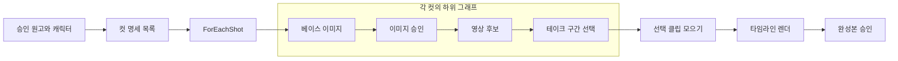

# snowlink-studio 노드 기반 제작 설계

작성일 2026-10-03 · 갱신일 2026-10-04 · 상태: 구현 제안 · 상위 요구사항: [PRD](PRD.md)

목표는 사용자가 원고·캐릭터·장면·영상·편집을 노드로 연결하고, 필요한 부분만 다시 실행할 수 있게 하는 것이다. 기존 노드 UI를 확장하되 작품의 실행 상태와 승인은 서버가 관리한다. 아래 스키마·API·모듈은 제안이며 아직 구현된 계약이 아니다.

10월 4일 결정에 따라 기본 진입점은 AI 대화다. 누적된 트렌드·후킹 분석을 검색해 기획 후보와 템플릿 기반 노드 초안을 제안한다. [근거 축적 설계](trend-intelligence-plan.md)를 적용하며 본인만 사용하는 도구로 개발한다.

## 1. 기존 코드 재사용과 변경 경계

| 현재 코드 | 재사용 | 필요한 변경 |
| --- | --- | --- |
| [NodeCanvas.tsx](../vendor/ima2-ui/src/components/NodeCanvas.tsx) | React Flow 조작·연결·선택 | 이미지/참조 중심 nodeTypes에 제작 노드 추가 |
| [nodeCompatibility.ts](../vendor/ima2-ui/src/lib/nodeCompatibility.ts) | 방향·중복·자료형·개수·순환 검사 | 원고·시트 집합·테이크·승인 등 도메인 자료형 추가 |
| [nodePortCatalog.ts](../vendor/ima2-ui/src/lib/nodePortCatalog.ts) | 포트 카탈로그 패턴 | 선언한 자료형과 실제 노드 바인딩을 함께 확장 |
| [storeNodeGenImpl.ts](../vendor/ima2-ui/src/store/storeNodeGenImpl.ts) | 의존 순서·실패 후 하위 분기 처리의 의미 | 브라우저 루프에서 서버 실행 요청으로 이동; 전역 영상 모드 대신 노드 operation 사용 |
| [storeVideoImpl.ts](../vendor/ima2-ui/src/store/storeVideoImpl.ts) | 기존 영상 요청·상태·연결 기능 | 작품/컷/테이크 ID, 선택 종료점, 엄격한 연결 모드, 역할별 설정 전달 |
| [cardNewsStore.ts](../vendor/ima2-ui/src/store/cardNewsStore.ts) | 초안·템플릿·카드 재생성 | 정식 제품 진입점, 공용 작품/자산/승인 ID 연결 |
| [cuts.mjs](../server/cuts.mjs) | revision·대화 이력·되돌리기 | 직접 전체 컷 교체에서 허용 필드의 변경안 검토로 확장 |
| [render.mjs](../server/render.mjs) | 기존 콘티 렌더 어댑터 | 실제 영상·오디오 타임라인 입력, 영속 작업 기록 |

기존 타입 목록에 video/prompt 등이 있다는 이유로 해당 제작 노드가 모두 구현된 것으로 간주하지 않는다. 현재 이미지 노드 데이터에 모든 역할을 계속 추가하기보다, operation별 입력·출력·설정을 정의하고 기존 이미지 노드를 호환 어댑터로 등록한다.

## 2. 화면 구성

- 왼쪽 제품 메뉴는 유지한다. 작품 내부에 단계/노드 보기 전환과 채널·작품 표시를 둔다.
- AI 기획 대화에는 관련 사례·확인 범위·선택 이유를 표시한다. 사용자가 방향을 정하면 근거 노드와 원고/제작 노드를 만들고 수동 수정할 수 있게 한다.
- 노드 보기 왼쪽은 자료·노드 검색, 가운데는 그래프, 오른쪽은 선택 노드의 설정·입출력·승인·이력이다. 아래에는 실행 목록과 타임라인을 접어 둔다.
- 노드 헤더에는 이름·종류·모델·상태를, 본문에는 입력 미리보기와 최신 결과를 표시한다. 모든 영상 썸네일을 동시에 재생하지 않는다.
- 실행 버튼은 `이 결과까지`, `변경된 부분`, `새 후보 생성`을 구별한다. 실행 전에 필요한 선행 작업·승인 대기·예상 호출 수를 보여준다. 비용을 알 수 없으면 그 사실을 표시한다.
- 단계 보기에서 수정한 내용과 노드 보기는 같은 workflow revision을 사용한다. 기본 템플릿의 순서와 분기를 단계로 투영하고 별도 상태를 복제하지 않는다.
- 자유 그래프가 단계 보기에서 표현할 수 없는 경우 해당 사용자 정의 단계를 접어 요약하고 노드 보기로 이동시킨다. 데이터를 삭제하거나 순서를 임의 평탄화하지 않는다.

색상·간격·선택·오류·대기 표시는 [기존 토큰](../design/tokens.json)에 의미 토큰으로 추가한다. 노드마다 임의 hex 값을 쓰지 않는다. 포트 유형과 승인 상태는 아이콘·문구를 병기하고 키보드로 연결 대상과 실행 동작을 선택할 수 있게 한다.

## 3. 제작 노드 카탈로그

이 표는 사용자가 다루는 단위다. 모델의 sampler 등 저수준 추론 파라미터를 초기 화면의 중심으로 삼지 않는다.

| 노드 | 주요 입력 → 출력 | 실행 또는 검토 |
| --- | --- | --- |
| 채널·세션 | 채널/세션 ID → ChannelContext, Brief | 설정·메모리 스냅샷 확정 |
| 소재·근거 | TrendSource[] 또는 직접 원고 → SourceBundle | 출처·시각·사실 확인 상태 유지 |
| 관련 사례 검색 | ChannelContext + Brief → ReferenceContent[] | 누적 저장소에서 형식·언어·주제·시점을 기준으로 검색 |
| 후킹·전개 분석 | 확인된 EvidenceAsset[] → ContentAnalysisVersion | 확인 범위·타임코드·분석과 추정을 구분; 유효한 기존 분석 재사용 |
| 제작 근거 선택 | ContentAnalysisVersion[] + 사용자 방향 → ResearchBundle | 실제 사용할 사례·분석 버전과 적용 이유 고정 |
| 원고 | Brief + SourceBundle + ResearchBundle → ScriptVersion | 근거 기반 기획 역할 모델, 원고 승인 필요 |
| 배역·캐릭터 시트 | Script + CastSet → CharacterSheetSet | 기존/신규 캐릭터와 역할별 자산 버전, 캐릭터 승인 |
| 시퀀스·컷 분해 | 승인 원고 + 배역 → ShotSpec[] | 의미 단위와 모델 호출 단위 분리 |
| 장면 베이스 이미지 | ShotSpec + 승인 시트 + 배경 → ImageAsset | 이미지 역할 모델, 장면 이미지 승인 |
| 영상 생성 | ShotSpec + 승인 ImageAsset + 지원 참조 → Take | 노드별 모드·모델, 실제 생성 영상 |
| 테이크 선택 | Take[] → ClipSelection[] | 사용자가 sourceIn/sourceOut 선택 |
| 연결 상태 | ClipSelection + 이야기 상태 → ContinuityContext | 채택 종료 프레임·인물·소품·대사 |
| 영상 편집·렌더 | ClipSelection[] + 자막/오디오 → TimelineVersion, VideoAsset | 재생 순서·실제 길이·트랙 합성 |
| 카드 문안·분량 | Brief + SourceBundle + ResearchBundle → CardPlanVersion | 주제에 맞는 카드 수와 역할 제안, 사용자 합치기/나누기 후 문안 승인 |
| 카드 시각 자료·배치 | 승인 CardPlan + 브랜드/선택 캐릭터 → SlideSet | 그림과 텍스트 분리, 카드별 교체 |
| 승인 | ArtifactVersion + 요구 승인 단계 → ApprovalRef | 서버가 발급한 대상·버전·범위 참조 |
| 내보내기 | 승인 OutputVersion → ExportManifest | 파일·메타데이터·검토한 버전 |
| 게시 대기 / R3 | 승인 출력 + 대상 채널 + 게시 설정 → PublishJob | 별도 플랫폼 연결·정책 검사 |
| 작품 성과 연결 / R2 | 게시물 ID + 출력/후킹 버전 → ProductionOutcome | 허용된 원본 지표와 사용자 평가 저장; 다음 세션의 근거로 검색 |

`AudioReference`는 provider voice ID와 업로드 파일을 서로 다른 subtype으로 둔다. 지원되지 않는 변환을 자동으로 만들지 않는다. `ImageAsset`도 character-identity, costume, background, first-frame 등의 역할을 가진다. 배역 연결은 배열 순서가 아니라 명시한 characterId로 결정한다.

## 4. 그래프·반복·타임라인 규칙

그래프는 순환이 없는 의존 관계(DAG)로 저장한다. `ForEachShot`은 유한한 ShotSpec 목록을 컷별 하위 그래프로 펼치는 실행 단위다. 목록 상한·동시 실행 한도를 서버 설정으로 제한하고 각 컷의 안정된 ID를 유지한다. 재시도와 다음 구간 생성은 그래프의 역방향 연결로 표현하지 않는다.

재생 순서는 별도 TimelineVersion에 명시한다. 그래프 노드 좌표, 생성 완료 순서, 목록 정렬 순서로 재생 순서를 추론하지 않는다. 한 컷 안에서 복수 테이크 구간을 사용해도 원본과 각 구간의 계보를 보존한다.

긴 영상은 이전 구간의 선택 결과를 다음 구간의 입력으로 연결한다. 연속 동작과 장소·시간 전환을 구분한다. 선택한 종료 프레임 추출에 실패하면 연결 확인 대기 상태로 멈추고, 기존 경로의 텍스트 생성 fallback을 엄격한 연속성 모드에서 금지한다.

정기 트렌드 수집은 작품 생성과 분리한 수집 작업으로 실행한다. 새 자료나 성과가 들어오면 저장소를 갱신하고 다음 세션에서 조회한다. 완료된 원고 노드로 역방향 연결해 자동 재생성하지 않는다. 카드 반복은 승인된 CardPlan의 가변 목록을 펼치는 `ForEachCard`로 표현한다.

## 5. 저장 계약

| 레코드 | 필수 의미 |
| --- | --- |
| WorkflowRevision | schemaVersion, workflowId, productionId, revision, nodes, edges, templateVersion |
| NodeDefinition | 안정된 nodeId, operation/version, typed ports, params, modelRole/override, 정책 |
| CanvasView | 노드 위치·접힘·줌. 실행 내용 해시와 분리 |
| WorkflowRun | 고정 graphRevision, 설정 스냅샷, 실행 대상·범위, 시작한 사용자, 상태 |
| NodeRun | runId/nodeId/itemId, 입력 자산 버전, 실제 모델·모드, attempt, upstreamJobId, 결과·오류 |
| AssetVersion | content hash, URI, 미디어 정보, 역할·출처, 생성 명세·입력 계보, 소유/공유 범위 |
| Approval | 대상 ID·버전/해시, 승인 종류, 검토자·시각, 승인 범위, 무효화 이유 |
| TimelineVersion | 순서 있는 takeId/sourceIn/sourceOut, 전환·트랙·출력 규격, 편집 revision |
| ResearchBundle | 참고 콘텐츠/분석 버전, 채택 이유·제외 이력, 검색 조건, 근거 기준 시점 |
| ProductionOutcome | 출력/원고/후킹 버전, 실제 게시물 ID, 원본 성과·관측 기간·사용자 평가 |

실행을 시작하면 입력 버전·유효 설정을 고정한다. 모델 역할 기본값을 나중에 바꿔도 진행 중 실행에는 적용하지 않는다. 모델 버전이 제공되지 않으면 실제 식별자와 호출 시각을 기록하며 완전한 재현성을 보장하지 않는다.

하위 그래프와 템플릿은 버전을 고정해 작품에 연결한다. 템플릿 수정으로 과거 작품을 자동 변경하지 않는다. 명시적인 업그레이드에서 차이·영향·필요 승인을 보여준다.

분석 노드의 재사용 키에는 원본 자료 버전·확인 구간·분석 모델/프롬프트 버전도 포함한다. 외부 근거가 만료·삭제되면 원본 보관 정책에 따라 종속 분석과 검색 캐시도 정리하고 영향받은 ResearchBundle을 표시한다. 지표 값을 임의로 0으로 대체해 분석을 계속하지 않는다.

권고 저장소는 SQLite 등 트랜잭션을 지원하는 영속 저장소다. `studio.json`과 컷 JSON을 백업·변환하고 수량·ID·파일 참조를 대조한 뒤 쓰기를 전환한다. 자산 파일은 기존 파일 저장소를 이용한다. 실행 중 프로세스 강제 종료와 복원 시나리오를 검증하기 전 이관 완료로 표시하지 않는다.

## 6. 실행 상태와 복구

실행 상태는 `queued → running → succeeded`가 기본이다. 사람 승인은 `waiting_approval`, 인증/한도는 `waiting_resource`, 의존 실패는 `blocked_dependency`, 접수 불명확은 `reconciling`으로 분리한다. 실패·취소는 `failed/canceled`로 기록한다. 결과의 최신성 `current/stale`은 실행 상태와 별개다.

1. 서버가 그래프 자료형·필수 입력·승인·capability·revision을 검사한다.
2. 실행 범위와 필요한 선행 노드를 계산한다. 유효한 기존 산출물을 재사용하고 새로 생성할 노드를 구분한다.
3. NodeRun과 제출 의도를 먼저 저장한다. 제공자별 동시 실행 제한 안에서 요청하고 업스트림 작업 ID를 연결한다.
4. SSE/폴링 결과를 자산 버전과 매핑한다. 중복 이벤트를 한 번만 적용하고 서버 이벤트 커서로 UI를 복원한다.
5. 중단 후에는 접수된 작업을 먼저 조회한다. 제공자가 조회나 idempotency를 지원하지 않아 접수 여부를 알 수 없으면 확인 대기하며 자동 재전송하지 않는다.
6. 취소는 새 하위 작업 제출을 중단한다. 이미 접수된 원격 작업의 취소 가능 여부를 표시하고 늦게 도착한 결과도 기록하되 임의 채택·승인하지 않는다.

실패한 분기의 후속 노드는 멈추고 관련 없는 분기는 계속 실행할 수 있다. 브라우저가 열려 있어야 실행 루프가 진행되는 구조는 제거한다. 서버 재시작 중 접수 여부를 확인할 수 없는 경우까지 무조건 한 번 실행을 보장한다고 주장하지 않는다.

### 재사용과 재생성

재사용 키는 operation/version, 입력 자산 버전, 설정, 실제 제공자/모델/모드 등 결과에 영향을 주는 값이다. 좌표 이동은 키를 바꾸지 않는다. 동일 조건의 완료 결과는 재사용하되 `새 후보 생성`은 명시적으로 새 attempt를 만든다. 확률적 모델의 출력이 항상 같다는 의미의 캐시는 아니다.

기본 한도는 컷별 최초 1회+자동 재생성 3회다. 낮은 해상도 후보와 고화질 후보도 합산하고 새 노드 ID를 만들었다고 자동 상한을 초기화하지 않는다. 품질 문제의 사유와 입력 변경을 기록한다. 자동 품질 검사는 실제 구현된 검사에 한해서만 수행한다. 한도 초과 뒤 추가 생성은 사용자의 명시적 선택과 별도 기록이 필요하다.

통신 재시도와 새 생성은 분리한다. 인증 만료·한도·요청 전 검증 실패는 새 품질 후보가 아니다. 접수된 생성의 과금·실패 여부는 제공자가 확인해 주는 정보로 기록하며 불확실한 항목을 성공/무료로 임의 분류하지 않는다.

## 7. 승인을 그래프 밖에서도 보장

승인 노드는 사람이 기다리고 있는 지점을 보여준다. 실제 정책은 서버가 검증한다. 클라이언트가 ApprovalRef를 임의 만들어 제출하거나 승인 노드를 연결에서 빼더라도 해당 자산의 단계 승인이 없으면 제한된 다음 작업을 실행하지 않는다.

승인은 정확한 버전과 적용 범위에 연결한다. 수정 시 하위 계보를 따라 최신성을 검사하고 영향받은 결과와 승인을 재검토 대상으로 표시한다. 과거 승인 이력은 지우지 않는다. 이전 결과로 되돌릴 때도 현재 입력과 정책에 맞는지 다시 판단한다.

캐릭터를 사용하지 않는 카드뉴스는 적용 없음의 근거를 남긴다. 승인된 캐릭터 자료를 다른 작품에 쓰는 경우 공유 범위와 해당 버전의 유효성을 확인한다. 완성본 승인에는 출력 파일뿐 아니라 해당 편집 버전을 연결한다. 게시 대상·제목·설명·일정을 바꾸면 게시 설정은 다시 검토한다.

## 8. 모델과 렌더 어댑터

`AuthConnection`, `ModelCapability`, `OperationAdapter`를 분리한다. capability에는 인증 경로, 입력 모드, 길이, 해상도, 참조 역할/개수, 음성, 연장 방식, 동시 실행, 조회·취소 지원과 확인 시각을 둔다. `지원/미지원/미확인`을 구별한다.

GPT 이미지 기획 모델과 실제 렌더러를 분리해 기록한다. Grok의 첫 이미지 입력, 다중 참조, voice ID 조합은 현재 연결에서 가능한 것만 노출한다. 세부 로컬 제약은 [애니메이션 계획](animation-workflow-plan.md)에 있으며 실행 시 현재 어댑터와 대조한다. 30~60초 구간 길이를 단일 요청으로 그대로 보내지 않는다.

렌더 어댑터는 실제 파일의 길이·프레임률·오디오를 조사하고 유효한 사용 구간만 받는다. 미리보기와 내보내기가 같은 TimelineVersion을 사용하도록 한다. 자막/음량 수정은 원본 영상 생성 호출 없이 다시 렌더한다. 합쳐진 생성 음성을 자동 분리할 수 있다고 가정하지 않는다.

선택적 ComfyUI 어댑터는 명시된 입력·출력만 가진 외부 워크플로 하나를 production node로 감싼다. 모델·커스텀 노드 의존성과 실행 환경을 검증한 뒤 추가한다. 일반 제작 그래프와 ComfyUI JSON을 같은 형식으로 취급하지 않으며 임의 명령·플러그인 설치 기능을 노출하지 않는다.

## 9. 제안 API와 모듈

| 제안 경계 | 책임 |
| --- | --- |
| workflowSchema / nodeRegistry | 스키마 버전, operation·포트·정책 계약과 검증 |
| workflowStore / productionAssets | 그래프·자산·버전 저장, 이관·revision 검사 |
| workflowRunner / providerAdapters | 실행 계획, 영속 큐, upstream 매핑, 복구·취소 |
| productionApprovals / productionTimeline | 승인 계보·영향, 채택 구간·연결 상태·렌더 명세 |
| GET/PUT `/api/productions/:id/workflow` | 저장된 revision 조회·조건부 수정 |
| POST `/api/productions/:id/workflow/plan` | 실행할 노드·재사용 결과·대기 조건 계산; 생성 호출 없음 |
| POST `/api/productions/:id/runs` | revision과 실행 범위로 영속 실행 시작; 202와 runId 반환 |
| GET `/api/runs/:id` / POST `/api/runs/:id/cancel` | 상태 복구·취소 의도 저장 |
| POST `/api/approvals` | 대상 버전·단계·검토 범위로 승인 기록 |
| POST `/api/productions/:id/workflow/proposals` | 대화 수정안 생성; 적용과 생성 실행은 별도 동작 |

기존 API는 호환 계층을 유지한다. AI가 임의 서버 파일 경로나 셸 명령을 반환하는 수정 계약은 허용하지 않는다. 제안 모듈 이름은 구현 시 기존 파일 크기와 책임을 고려해 나눈다.

## 10. 구현·검증 순서

1. 공용 ID·자산 버전·그래프 스키마·저장 이관과 참고 자료/분석 저장을 정의한다. 기존 기획과 단일 이미지 캐릭터를 손실 없이 읽는다.
2. 관련 사례 검색과 기획 대화에서 기본 영상/카드 그래프를 구성하고 서버 실행기에 연결한다. 접수 직후 응답 유실, 서버 종료, 늦은 이벤트, 중복 실행을 검증한다.
3. 버전 승인과 실제 클립/카드 출력 경로를 연결해 [PRD R1](PRD.md)의 두 결과물을 완성한다.
4. 자유 노드 편집·부분 실행·템플릿·대화 수정·복수 테이크·긴 구간 연결을 확장한다.
5. 수동 게시물/읽기 전용 성과 연결부터 검증하고, 게시 어댑터와 운영 큐는 승인된 결과를 입력으로 연결한다. 실제 ComfyUI 실행은 별도 선택 단계로 검증한다.

핵심 회귀 기준은 노드 좌표 변경의 생성 호출 0회, 상관없는 분기의 재생성 0회, 순환/잘못된 포트 차단, 상위 버전 변경의 승인 영향 표시, 재접속 후 동일 run 복원, 잘라 쓴 테이크의 올바른 종료 프레임, 카드 문구 변경의 이미지 호출 0회다. 시각·음성 품질 검증은 계약 테스트와 별도로 수행한다.
