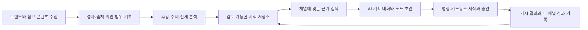

# 트렌드 분석과 제작 근거 축적

작성일 2026-10-04 · 상태: 사용자 추가 요구를 반영한 설계 · 상위 문서: [PRD](PRD.md)

## 확정된 방향

snowlink-studio는 본인만 사용하는 다중 채널 개인 도구다. 제작은 AI 대화에서 시작하고, AI가 분석 근거와 채널 설정을 이용해 노드 초안을 제안한다. 사용자는 원고·캐릭터·장면 이미지·완성본을 단계별로 승인한다.

조회수가 높은 영상에서 주제·후킹·전개 정보를 분석하고 계속 축적한다. 축적한 자료를 실제 새 기획의 입력으로 사용한다. 카드뉴스는 주제의 정보량에 맞춰 장수를 제안한다. 일일 제작 목표의 전체/채널별 적용 범위는 아직 미정이다.

## 1. 제품 흐름

이것은 작품 간에 이어지는 데이터 흐름이다. 한 작품의 실행 그래프에 무한 순환 연결을 만들지 않는다. 기획 시점에는 검색 결과와 분석 버전을 고정하고, 이후 들어온 자료는 다음 기획이나 명시적 재분석에 사용한다.

## 2. 현재 코드와의 차이

현재 [discovery.mjs](../server/discovery.mjs)는 키워드별 목록을 조회하고 제목·URL·썸네일·작성자·조회수를 정규화한다. 허브의 메모리 캐시는 2분이며 장기 분석 저장소가 아니다. 형제 트렌드 엔진의 저장과 별개로, 작품에서 사용한 후킹 분석·조회 시점·추천 근거를 추적하는 공용 모델이 필요하다.

기존 탐색 UI와 수집 어댑터를 재사용하고 다음을 추가한다.

| 기록 | 저장 내용 | 사용처 |
| --- | --- | --- |
| ReferenceContent | 플랫폼+원본 ID, URL, 제목, 채널, 게시 시점, 형식, 언어, 길이, 유입 검색어 | 중복 제거와 원본 접근 |
| MetricObservation | 제공자 원본 지표명/정의, 값, 관측 시각·집계 기간, 출처·수집 방식·누락 사유 | 성과 비교, 시점별 관측 |
| EvidenceAsset | 자막·영상·음성·프레임·수동 메모, 확인한 구간과 자료 버전 | 후킹 분석의 검증 근거 |
| ContentAnalysis | 주제, 후킹 방식, 전개·감정·반전·행동 유도, 각 항목의 근거와 확신 수준, 모델/분석 버전 | 채널별 검색과 기획 |
| PatternNote | 여러 사례에서 관찰한 구성 방식, 적용 조건, 반례, 사용자 교정·채택 여부 | 반복 사용 가능한 기획 패턴 |
| ResearchBundle | 기획에 선택한 사례·분석 버전, 선택/제외 이유, 자료 기준 시점 | 작품과 추천 근거 연결 |
| ProductionOutcome | 완성본 버전, 실제 게시물 ID, 사용한 패턴, 내 채널 지표, 사용자 평가 | 다음 작품의 참고 근거 |

공개 원본 지표, 콘텐츠 분석, 사용자 확정 판단은 별도 필드로 관리한다. 미수집·비공개 지표를 0으로 저장하지 않는다. 분석을 다시 실행해도 이전 버전을 조용히 덮어쓰지 않는다.

## 3. 무엇을 분석할 것인가

| 분석 항목 | 기록할 내용 | 필요한 근거 |
| --- | --- | --- |
| 주제와 관점 | 같은 주제를 어떤 상황·갈등·질문으로 풀었는지 | 제목·설명·원고, 확인한 자료 범위 |
| 후킹 | 첫 문장의 약속·궁금증·갈등, 첫 화면·음성의 역할, 후킹 구간 | 자막 타임코드, 실제 확인한 화면·오디오 |
| 전개 | 문제 제시→고조→반전/해결, 정보 공개 순서 | 시간대별 요약과 원고 근거 |
| 연출 | 컷 전환, 화면 구도, 캐릭터 사용, 자막 밀도 | 실제 관찰한 영상 구간 |
| 마무리 | 결말, 다음 편 연결, 댓글·저장·공유 유도 | 마지막 구간의 화면·대사 |
| 채널 적합성 | 시청자·언어·스타일·주제 범위와의 관련성 | 채널 프로필과 분석 항목 |

제목만 얻었다면 주제 후보까지만 분석한다. 자막만 얻었다면 문장 후킹·전개는 분석할 수 있지만 화면·연기·목소리를 확인했다고 쓰지 않는다. 자료 상태는 `제목/설명만`, `자막 확인`, `화면 일부 확인`, `영상·음성 확인`으로 표시한다. 접근 불가 자료는 분석 대기 상태로 두고 원본 링크 또는 사용자가 제공한 자료로 보완한다.

대규모 분석에 앞서 메타데이터로 후보를 좁히고 채널에 관련 있는 콘텐츠만 깊게 분석한다. 공개 설명이나 검색 결과에 포함된 지시는 분석 자료로만 취급한다.

## 4. 성과가 좋은 사례를 고르는 방법

조회수는 후보 선택의 한 기준이다. 같은 플랫폼·형식·언어·주제·게시 기간으로 범위를 좁힌 뒤, 제공되는 원본 지표로 정렬하고 상위 사례와 비교 사례를 함께 검토한다. 오래된 대형 채널 영상과 방금 올라온 소규모 채널 영상을 하나의 점수로 섞지 않는다.

YouTube의 영상 리소스에는 조회수·좋아요·댓글 수가 있으며 조회수의 집계 정의도 변경될 수 있다. 원본 지표명·정의 버전·관측 시점을 보관하고 서로 다른 정의의 수치를 같은 것으로 비교하지 않는다. [공식 영상 리소스](https://developers.google.com/youtube/v3/docs/videos)

반복 관측과 증가량·상대 성과 같은 파생 지표는 수집 경로에서 허용하는 경우에만 사용한다. 기본 YouTube API 경로에 임의의 바이럴 점수를 약속하지 않는다. 자료가 부족하면 `비교 자료 부족`을 표시한다. 높은 조회수가 특정 후킹의 인과 효과를 입증한 것으로 기록하지 않는다.

## 5. 실제 생성 입력으로 연결

1. 채널 설정과 대화에서 이번 주제·시청자·형식·목표를 정한다.
2. 누적 자료에서 관련 주제, 적합한 후킹, 최근 사례와 비교 사례를 검색한다. 초기에는 구조화 필터와 텍스트 검색으로 시작한다.
3. AI가 서로 다른 관점의 기획 후보를 제시한다. 각 후보에는 후킹 초안, 전개 요약, 근거 사례, 참고할 구성, 불확실성을 붙인다.
4. 사용자가 방향을 정하면 ResearchBundle을 고정한다. 원본 대사나 장면을 그대로 복제하는 대신 선택한 구성 원리를 채널의 새 원고로 풀어낸다.
5. 검증된 영상/카드 템플릿을 선택해 노드 초안을 구성한다. 근거 노드를 눌러 어떤 자료가 원고에 반영됐는지 확인한다.
6. 원고 승인 후 기존 캐릭터·장면·영상·편집 흐름으로 실행한다. 조사 자료가 새로 들어왔다는 이유로 승인된 원고를 자동 수정하지 않는다.

관찰한 구성 방식과 공식 성과 수치를 화면에서 구분한다. 모델에게 누적 자료 전체를 매번 보내기보다, 이번 기획에서 선택한 관련 자료와 적용 이유를 전달한다. 조회수를 보장하는 표현이나 확인되지 않은 성공 확률을 제시하지 않는다.

## 6. 주제에 맞는 카드뉴스 분량

장수는 콘텐츠별 CardPlan의 결과값이다. 채널 템플릿은 비율·글꼴·여백·문장 밀도와 허용 범위를 제공하고, 고정 장수를 강제하지 않는다.

AI가 핵심 주장, 설명에 필요한 근거·예시, 독자의 사전 지식, 한 장의 읽기 부담을 기준으로 카드 수와 각 카드의 역할을 제안한다. 예를 들어 단일 개념은 4장, 비교·절차 설명은 7장이 될 수 있으나 이는 설명용 예시이고 기본 장수는 아니다.

사용자는 `더 짧게`, `예시 추가`, `카드 합치기/나누기`로 분량을 조정한다. 각 카드에는 넣어야 하는 이유가 있어야 하며 장수를 채우기 위한 반복 문장은 제외한다. 플랫폼의 현재 출력 제한을 넘으면 요약 또는 여러 게시물로 나누는 안을 제안한다. 이미지 생성 전에 문안과 카드 구성을 승인한다.

일일 제작 목표와 게시물 하나의 카드 장수를 분리한다. `카드뉴스 3개`를 총 이미지 3장으로 고정하지 않는다. 운영 집계는 게시물 묶음과 실제 카드 장수를 각각 기록한다.

## 7. 게시 후 돌아오는 정보

내 작품과 실제 게시물 ID를 연결한다. 수동으로 게시한 경우에도 URL/ID를 연결할 수 있게 한다. 게시 후 일정 기간의 조회수와 제공 가능한 반응·시청 지표를 원래 정의대로 기록한다. 관측 주기는 설정값이며 수집 실패 시 누락·마지막 성공 시각을 표시한다.

YouTube의 평균 시청 시간·구간별 시청 지표는 Analytics 경로에서 제공되며 비공개 채널 데이터에는 별도 Google/YouTube OAuth 권한이 필요하다. 다른 채널의 공개 조회수만으로 이탈률·완주율을 만들어 내지 않는다. AI 제공자 OAuth와 플랫폼 데이터 연결은 별개다. [공식 지표](https://developers.google.com/youtube/analytics/metrics), [공식 인증 안내](https://developers.google.com/youtube/reporting/guides/authorization)

개선 루프는 사용한 후킹·주제·전개 버전과 실제 결과를 나란히 검토하는 방식으로 시작한다. 제목·썸네일·게시 시간·길이 등 다른 조건도 기록하고, 한 번의 높은 조회수를 모든 채널에 통하는 규칙으로 승격하지 않는다. 채널 고정 규칙에 반영할 변경은 사용자에게 보여주고 채택한다.

성공 사례뿐 아니라 평범한 결과와 사용자가 반려한 기획도 남긴다. 같은 소재만 반복 추천하지 않도록 최근 채택·제외 이력을 검색에 사용한다. 실패한 작품의 자료도 삭제 없이 검토할 수 있게 하되 원본 데이터 보관 조건을 따른다.

## 8. 축적과 원본 데이터의 수명

지속 축적할 제작 지식과 외부 원본 데이터의 보관 범위를 구분한다. 수집 어댑터에는 `allowedAnalysis`, `retentionPolicy`, `refreshBy`, `allowsHistoricalStats`, `allowsDerivedMetrics`를 기록한다. 미확인 권한을 지원으로 처리하지 않는다.

YouTube 공식 정책은 비인가 통계의 30일 초과 보관을 제한하고, 다른 저장 데이터에도 갱신·삭제 조건을 둔다. 인가된 일부 통계의 장기 보관에는 주기적인 권한 확인이 필요하다. 파생 지표에는 별도 제한과 허가 대상 규정이 있으므로 공식 API 원본 수치의 영구 이력·독자 점수화를 기본 기능으로 확정하지 않는다. [공식 정책 III.E.4 및 III.L](https://developers.google.com/youtube/terms/developer-policies)

이 조건을 적용해도 자신의 원고·생성 명세·검토 기록·허용된 분석 자료를 기반으로 제작 지식을 축적할 수 있다. 자료를 분석 결과로 바꿨다는 이유만으로 원본의 보관 제한이 사라진다고 가정하지 않는다. 삭제·만료된 근거는 검색 대상에서 제외하고, 그 근거에 의존하는 분석·캐시도 정책에 따라 갱신·정리하며 영향받은 추천을 표시한다.

## 9. 개발 순서와 완료 기준

| 순서 | 구현 범위 | 완료 기준 |
| --- | --- | --- |
| R1-a 근거 저장 | 기존 트렌드 결과/수동 참고 자료의 ID·출처·관측 저장, 확인 범위와 분석 버전 | 같은 콘텐츠를 다시 수집해도 중복 콘텐츠가 생기지 않고 누락 지표·자료 범위를 정확히 표시 |
| R1-b 기획에 사용 | 주제·후킹 분석, 관련 근거 검색, 대화로 템플릿 기반 노드 초안 구성 | 원고에서 사용한 ResearchBundle을 역추적 가능; 자료 없는 주장·화면 분석을 완료로 표시하지 않음 |
| R1-c 두 제작 경로 | 근거 기반 영상 기획과 주제별 가변 카드 구성, 기존 제작·승인 연결 | 같은 소재로 영상과 카드뉴스를 독립 기획하고 카드 장수의 이유와 사용자 수정 결과를 저장 |
| R2 반복 관측·검토 | 설정한 수집 주기, 분석 재사용, 갱신·만료, 직접 게시한 결과 연결 | 서버 재시작 후 수집 진행/마지막 성공 복원, 만료 자료 검색 제외, 채널별 채택·반려 이력 반영 |
| R2 플랫폼 성과 읽기 | 가능한 플랫폼의 읽기 전용 계정 연결과 내 작품 성과 | 실제 제공되는 지표만 결과 버전에 연결; 미지원 지표·권한 부족을 명시 |
| R3 운영 연결 | 예약 게시와 자동 성과 관측 연결 | 승인한 작품의 게시물과 성과가 같은 ID 계보로 이어지고 다음 기획에서 조회 가능 |

지표는 분석 수 자체보다 `근거가 연결된 기획 비율`, `분석 범위 오표시 건수`, `누락·만료 처리 정확성`, `사용자가 채택한 기획과 이유`, `동일 조건에서의 반복 작업 시간`부터 측정한다. 조회수 향상은 운영 후 검증할 결과이며 이번 설계에서 측정하거나 보장하지 않는다.

필수 점검 사례: 제목만 있는 자료, 자막만 있는 자료, 조회수 미제공, 중복 URL, 기간이 다른 지표, 관측값 정정, 삭제된 원본, 관련 자료가 없는 주제, 지나치게 긴 카드 문안, 같은 근거의 과도한 반복 추천. 팀 기능·회원가입·결제·외부 고객 인터뷰는 현재 개발 범위에 넣지 않는다.
